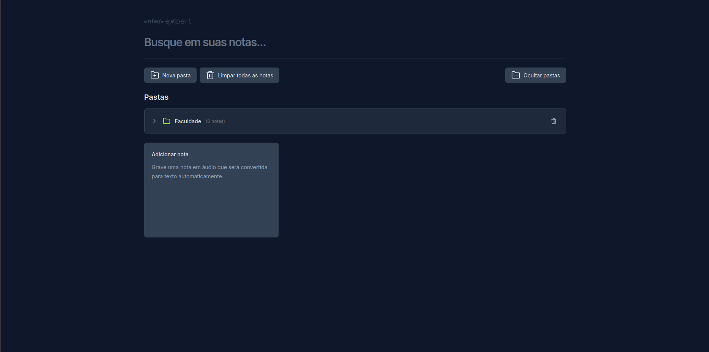

<div align="center">
	
  
	# NLW Expert Notes
  
	Aplicação web para criação, organização e busca de notas com suporte a transcrição de áudio em tempo real.
	<br />
	<a href="https://nlw-expert-notes-liard.vercel.app/" target="_blank"><strong>🔗 Acesse a aplicação</strong></a>
</div>

---

## 📌 Sobre o Projeto

Este projeto foi desenvolvido durante o bootcamp NLW-Expert (trilha React) da Rocketseat e expandido com novas funcionalidades como organização em pastas e movimentação de notas. Ele permite criar notas via texto ou voz (usando a Web Speech API) e organizá-las de maneira simples e rápida.

## 🖼 Preview

<div align="center">
	
	<br />
	<em>Tela exibindo busca, criação de pasta e card para adicionar nota.</em>
</div>

## Tecnologias Utilizadas

- TypeScript
- React
- Tailwind CSS
- Lucide-icons
- Radix-UI
- Sonner

## ✨ Funcionalidades

- Criar notas por texto ou fala (transcrição em tempo real via Web Speech API)
- Organização de notas em pastas (expandir/recolher)
- Criar nota diretamente dentro de uma pasta selecionando-a no momento da criação
- Mover notas entre pastas ou para "Notas sem pasta"
- Exclusão de notas individualmente ou limpeza total
- Exclusão de pastas (com migração automática das notas para "Notas sem pasta")
- Busca global (filtra notas dentro e fora de pastas)
- Persistência em `localStorage`
- Interface responsiva e acessível (Radix UI + Tailwind)

### 🗂 Estrutura de Organização
As notas podem existir em dois contextos:

1. Notas sem pasta (lista plana inicial)
2. Notas dentro de uma pasta

Ao excluir uma pasta, suas notas são preservadas e movidas para o grupo "Notas sem pasta".

### 🗣 Transcrição de Áudio
Caso o navegador suporte `SpeechRecognition` / `webkitSpeechRecognition`, é possível ditar uma nota e ver o texto sendo transcrito ao vivo. Quando indisponível, a interface orienta o usuário a digitar manualmente.

> A API de reconhecimento de fala pode não funcionar em todos os navegadores (ex.: Firefox). Chrome ou Edge são recomendados.

## 🚀 Instalação & Execução

```bash
git clone https://github.com/jonassantoss/nlw-expert-notes.git
cd nlw-expert-notes
npm install
npm run dev
```

Servidor local (Vite) abrirá em algo como: `http://localhost:5173` (ou outra porta disponível).

### Scripts Disponíveis

| Script            | Descrição                                      |
|-------------------|------------------------------------------------|
| `npm run dev`     | Inicia o ambiente de desenvolvimento (Vite)    |
| `npm run build`   | Gera build de produção                         |
| `npm run preview` | Serve a versão build para inspeção local       |

## 🧱 Arquitetura Simplificada

```
src/
	App.tsx               # Composição principal e orquestração de estado
	components/
		new-note-card.tsx   # Criação de nota (texto ou fala) + seleção de pasta
		note-card.tsx       # Visualização / exclusão / mover nota
		new-folder-card.tsx # Criação de pasta
		folder-card.tsx     # Listagem/colapso de notas dentro da pasta
		move-note-dialog.tsx# Dialog para mover nota entre pastas
		Button.tsx          # Botão reutilizável
	assets/               # Logos e ícones estáticos
```

### Estado & Persistência

- `notes`: notas sem pasta
- `folders`: lista de pastas, cada uma contendo suas próprias `notes`
- Persistência total via `localStorage` (`notes` e `folders`)
- Movimentação de nota: remove da origem e reatribui destino (ou deixa sem pasta)

### Decisões de Design

- Notas dentro de pastas não são duplicadas na lista de "Notas sem pasta"
- Ao excluir uma pasta, evita-se perda de dados movendo notas para o espaço global
- A busca filtra tanto notas soltas quanto notas dentro de pastas

## 🧪 Uso Rápido

1. Clique em "Nova pasta" para criar uma pasta (opcional)
2. Clique em "Adicionar nota" para criar uma nota
3. Escolha ditar (gravação) ou digitar
4. (Opcional) Selecione uma pasta no seletor do modal
5. Abra uma nota para movê-la ou excluí-la
6. Use a busca para filtrar qualquer conteúdo
7. Limpe tudo com "Limpar todas as notas" (ação irreversível)

## ⚠️ Limitações / Próximos Passos

| Item | Status | Observação |
|------|--------|------------|
| Edição de nota | Em aberto | Ainda não implementado inline/modal |
| Tags/Categorias | Ideia | Poderiam complementar pastas |
| Sincronização cloud | Ideia | Ex: IndexedDB + backend / Supabase |
| Testes automatizados | Em aberto | Poderiam ser adicionados (Vitest/RTL) |
| Dark/Light toggle | Futuro | Hoje apenas tema escuro |

## 🤝 Como Contribuir

## Como Contribuir

Se você deseja contribuir para este projeto, siga as etapas abaixo:

1. Faça um fork do repositório
2. Crie uma branch para a sua feature (`git checkout -b feature/sua-feature`)
3. Faça commit das suas alterações (`git commit -m 'Adiciona nova feature'`)
4. Faça push para a branch (`git push origin feature/sua-feature`)
5. Abra um Pull Request

## 📄 Licença

Este projeto está licenciado sob a <a href="https://opensource.org/licenses/MIT">Licença MIT</a>.


## 📬 Contato

Se você tiver alguma dúvida ou sugestão, entre em contato:

- LinkedIn / Instagram / GitHub (@jonassantoss)
- E-mail: jonassoares.live@gmail.com

---

<div align="center">
	Feito com 💚 durante o NLW Expert e expandido com novas ideias.
</div>
